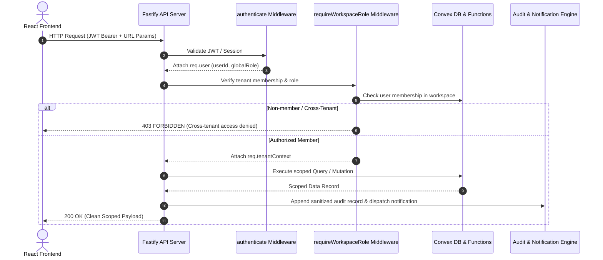

# Orviohub Architecture & System Design

This document details the authoritative technical architecture, tenant model, request lifecycle, application boundaries, and security enforcement mechanisms of the **Orviohub Platform**.

---

## 1. Canonical Hierarchy & Data Model

The multi-tenant structure of Orviohub is organized strictly hierarchically:

```text
User Account (Global Identity)
    │
    ▼
Organization / Workspace (Canonical Tenant Scope)
    │
    ▼
Application Scope (e.g., "inventory" - Demo MVP)
    │
    ▼
Branch Scope (e.g., "Ikeja Main", "Victoria Island Branch")
    │
    ▼
Membership & Role Permissions (Tenant & Branch Level)
```

### Identity Concepts
- **User Account**: Represents the authenticated person (`userId`). One user can create or join multiple Organizations.
- **Organization / Workspace**: The root billing, subscription, and data-isolation boundary (`workspaceId` / `organizationId`). All downstream entities belong to exactly one Organization.
- **Application (`productKey`)**: Modules available under the Organization. In the MVP release, **`inventory`** is the sole user-facing active application. Future applications (`pos`, `booking`, `gym`, `taskmanagement`) are disabled and registered as `coming_soon`.
- **Branch (`branchId`)**: Physical or logical operational location belonging to a specific Application within an Organization.
- **Membership**: Scoped binding of a `userId` to a `workspaceId` with an organization role (`owner`, `admin`, `member`, `viewer`), or to a `branchId` with a branch-specific role (`branch_manager`, `inventory_staff`, `viewer`).

---

## 2. Request Lifecycle & Authorization Pipeline

Every HTTP request to the Fastify API passes through a layered security and tenant context pipeline:



---

## 3. Entitlement & Quota Resolution

Orviohub enforces strict, tier-based limits calculated in `entitlementService.ts`:

| Plan Tier | Max Owned Orgs | Free Trial Duration | Max Branches / Org | Future Applications |
| :--- | :--- | :--- | :--- | :--- |
| **Free Trial** | 1 Trial Org / User | **30 Days** | **1 Branch** | Disabled (`coming_soon`) |
| **Standard** | 3 Total Orgs / User | N/A | **3 Branches** | Disabled (`coming_soon`) |
| **Premium** | 3 Total Orgs / User | N/A | **10 Branches** | Disabled (`coming_soon`) |

### Branch Quota Invariant
1. Branch creation requests check active non-archived branch count against `planLimits[plan]`.
2. When creating an organization, the primary demo branch (`isPrimary: true`) is provisioned automatically without exceeding the 1-branch limit.
3. Every Organization has **exactly one active primary branch**. Switching primary branches updates the target atomically and resets previous primaries.

---

## 4. Audit & Notification Consistency

1. **Audit Logs**:
   - Every mutation produces an immutable, append-only record with a canonical `EventContext` (`eventId`, `workspaceId`, `actorUserId`, `eventType`, `severity`, `timestamp`).
   - Deep secret sanitization (`stripSecrets`) scrubs all passwords, tokens, API keys, OTPs, CVVs, and authorization headers before persistence.
2. **Notifications**:
   - Scoped to categories: `security`, `workspace`, `inventory`, `billing`, `system`.
   - Idempotency enforced via deterministic deduplication keys:
     `${eventId}:${eventType}:${recipientUserId}:${channel}`.
   - Security notifications are hardwired as non-disableable.

---

## 5. Superadmin Governance Architecture

- Platform management is isolated from customer tenants under `/api/v1/admin/*`.
- **5-Tier Admin RBAC**:
  - `platform_owner`: Full break-glass and configuration rights.
  - `platform_admin`: Day-to-day tenant management.
  - `support_admin`: Read-heavy diagnostics and controlled support notes.
  - `billing_admin`: Subscription, refund, and invoice overrides.
  - `read_only_admin`: View-only access across all inspection tabs (mutations blocked with `403`).
- **Mutation Guardrails**:
  - Sensitive mutations (`suspend`, `plan-change`, `revoke-sessions`) require explicit reason headers (`x-admin-reason` or payload `reason`), rejecting with `400` if missing.
  - High-risk destructive mutations (`archive`) require step-up TOTP verification (`x-admin-totp`), rejecting with `403 STEP_UP_AUTHENTICATION_REQUIRED` if unverified.
