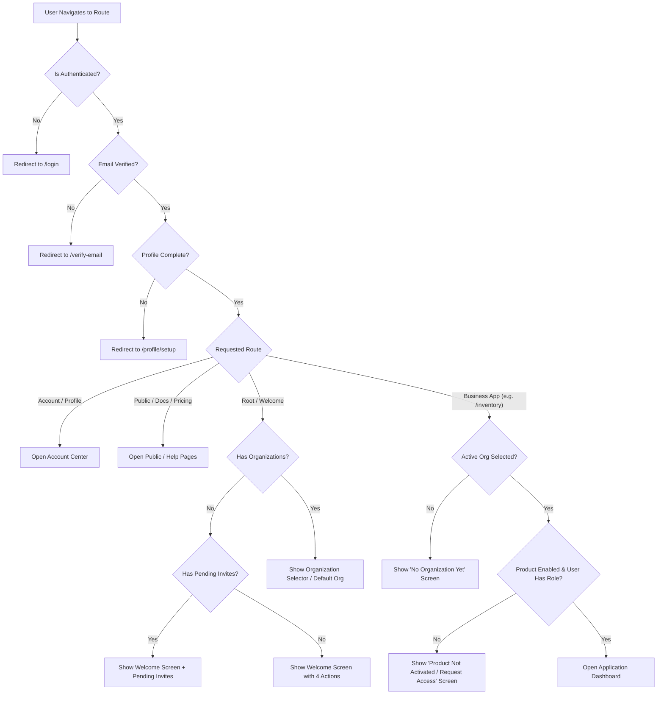

# Orviohub Authentication & Onboarding Architecture Specification
**Independent Personal Identity & Optional Multi-Tenant Organization Model**

---

## 1. Executive Summary & Core Decision

This document defines the official authentication, identity, onboarding, and multi-tenancy architecture for the **Orviohub Platform**.

### Core Decision
**An Orviohub account is mandatory for authentication, but an organization is optional.**

Orviohub operates on the **Zoho-style decoupled identity model**: account creation is strictly independent from organization creation. A person can register, authenticate, manage their personal profile, configure security and preferences, and navigate the account center without owning or joining any organization.

### The Official Policy
> *"An Orviohub account belongs to a person and can exist independently. An organization is optional and represents a business, store, company, team, or group. Users may create an organization, join an organization, belong to multiple organizations, or use Orviohub only as a personal account holder. Product operations require organization membership, but authentication and personal account management do not."*

---

## 2. Structural Identity & Hierarchy Model

```
Orviohub Account (Personal Identity)
├── Personal Profile (Name, avatar, contact info, bio)
├── Login Methods (Email/password, Google, Facebook, Passkeys)
├── Security & Sessions (MFA, active sessions, security audit events)
├── Notifications & Preferences (Email/push alerts, language, timezone, display theme)
├── Privacy & Data Controls (Data export, consents, account deletion)
├── Organization Memberships (0..many: Joined organizations owned by others)
└── Owned Organizations (0..many: Organizations created & owned by this user)
```

### Relational Cardinality
$$\text{users } (1) \longleftrightarrow (0..\text{many}) \text{ workspaceMemberships}$$
$$\text{workspaces } (1) \longleftrightarrow (1..\text{many}) \text{ workspaceMemberships}$$

$$\text{CRITICAL ANTI-PATTERN RULE: } \mathbf{users } (1) \longleftrightarrow (1) \mathbf{ workspace} \quad \text{\bf [PROHIBITED]}$$

### Concrete Identity Examples

| User | Orviohub Account | Owned Organizations | Joined Organizations | Effective Role & Product Access | Account Status |
| :--- | :--- | :--- | :--- | :--- | :--- |
| **David** | Active (`user_101`) | *None* (0) | *None* (0) | Personal account holder. Can manage profile, security, and explore public pages. | **Personal account only** |
| **Mary Johnson** | Active (`user_202`) | *None* (0) | **Code X Stores** (`ws_501`) | Member in Code X Stores. Sales Attendant in Inventory on "Main Store" branch. | **Joined Member** |
| **Code X** | Active (`user_303`) | **Code X Stores** (`ws_501`) | *None* (0) | Organization Owner & Workspace Owner of Code X Stores. Full administrative access. | **Organization Owner** |
| **Sarah Chen** | Active (`user_404`) | **Apex Consulting** (`ws_701`) | **Code X Stores** (`ws_501`), **Nova Gym** (`ws_802`) | Owner of Apex Consulting; External Accountant in Code X Stores; Member in Nova Gym. | **Multi-Org Owner & Member** |

---

## 3. Product Terminology & Onboarding Copy Standards

### Customer-Facing vs. Internal Technical Terms

| Concept | Customer-Facing Term | Internal Backend Term | Definition |
| :--- | :--- | :--- | :--- |
| **Personal Identity** | **Orviohub Account** | `User` / `UserIdentity` | The human individual who registers and logs in. |
| **Business Entity** | **Organization** | `Workspace` | A business, store, company, team, gym, club, school, or group. |
| **User-Org Link** | **Organization Membership** | `WorkspaceMembership` | The relation granting a user access to an organization. |
| **Org Controller** | **Organization Owner** | `WorkspaceOwner` | The user with primary ownership and billing responsibility. |
| **Org Participant** | **Organization Member** | `WorkspaceMember` | An invited or accepted user participating in the organization. |
| **Product Roles** | **App Role & Permissions** | `ProductMembership` | Granular role inside a specific app (e.g. Sales Attendant in Inventory). |

### Official UI Copy Standards

#### Onboarding Signup Explanation
> *"Create your Orviohub account. Your account lets you securely sign in, manage your profile, and access Orviohub applications. You can create an organization, join one by invitation, or continue without an organization and decide later."*

#### Post-Authentication Welcome Screen
- **Heading**: `“Welcome to Orviohub”`
- **Subheading**: `“What would you like to do?”`
- **Actions**:
  1. **Create an organization**: Start a new business, store, or team.
  2. **Join an organization**: Accept an invitation code or view pending invites.
  3. **Explore Orviohub**: Browse available applications, documentation, and demos.
  4. **Go to my account**: Manage personal profile, security, and preferences.

#### Application Empty-State (User Has No Organization)
> **Heading**: `“You’re signed in, but you haven’t joined an organization yet.”`  
> **Subheading**: `“Create an organization to start managing your business, or join an existing organization if someone has invited you.”`  
> **Actions**:
> - `[Create an organization]`
> - `[Join an organization]`
> - `[Go to my account]`

#### Inventory Application Empty-State (No Inventory Organization)
> `“You don’t have an Inventory organization yet. Create one to start managing products and sales, or join an existing organization if you have been invited.”`  
> **Actions**:
> - `[Create an organization]`
> - `[Join an organization]`
> - `[Return to my account]`

#### Product Unactivated State (User In Organization Lacking Product)
> `“You belong to an organization, but Inventory has not been activated for it yet.”`  
> **Actions**:
> - `[Choose another organization]`
> - `[Request access]`
> - `[Activate Inventory]` (if owner/admin)

---

## 4. End-to-End Authentication & Onboarding Journeys

```
                              [ User visits Orviohub ]
                                         │
                                         ▼
                     [ Sign Up / Log In (Email, Google, FB) ]
                                         │
                                         ▼
                        [ Email Verification (if required) ]
                                         │
                                         ▼
                       [ Basic Personal Profile Completion ]
                                         │
                                         ▼
                       [ Welcome Screen: "What would you like to do?" ]
                                         │
       ┌───────────────────┬─────────────┴──────────────┬───────────────────┐
       ▼                   ▼                            ▼                   ▼
  [ PATH 1 ]          [ PATH 2 ]                   [ PATH 3 ]          [ PATH 4 ]
Personal Account    Join an Org                  Create an Org       Explore Products
       │                   │                            │                   │
  Account Center     Review Invite & Role         Org Setup & Plan    Public Demos/Docs
  (Profile, Security, Accept & Enter Products     Invite Staff        (Empty States for
   Preferences)                                   App Dashboard        Business Actions)
```

### PATH 1: Personal Account Only
1. User registers an Orviohub account via email/password, Google, or Facebook.
2. User verifies email address when mandated.
3. User completes basic personal profile setup (First name, Last name, Display name, Timezone).
4. User selects **“Explore Orviohub”** or **“Go to my account”** on the Welcome screen.
5. User enters the unified Account Center.

**Personal Account Management Capabilities (No Organization Required):**
- Personal information (name, bio, job title, date of birth).
- Contact information (recovery email, mobile phone).
- Profile photo / avatar upload.
- Login methods (manage passwords, connect/disconnect Google or Facebook OAuth, passkeys).
- Password change & reset.
- Active sessions (view devices, IP addresses, revoke sessions).
- Security activity (view login attempts, security events).
- Notification preferences (email alerts, digest frequency, push channels).
- Language, timezone, regional formats (date, currency formatting), and display theme (dark/light/system).
- Privacy and data controls (data export requests, cookie consents).
- Connected third-party applications.
- Account deletion requests.
- Organization memberships & invitations dashboard.
- Product preferences.

### PATH 2: Join an Organization
1. User creates an account or signs in to an existing Orviohub account.
2. User verifies their email if required.
3. User opens an organization invitation link or views pending invitations in their account center.
4. User reviews the invitation details: Organization name, Invited by, Target product(s), Assigned role (e.g. Sales Attendant), Branch access restrictions, and Expiry timestamp.
5. User clicks **Accept Invitation**.
6. Backend activates the `workspaceMembership` and corresponding `productMemberships`.
7. User enters only the specific applications and branches permitted by their assigned roles.
*Note: A user never needs to own an organization to join someone else's organization.*

### PATH 3: Create an Organization
1. User creates or signs in to an Orviohub account.
2. User verifies email and completes basic profile setup.
3. User selects **“Create an organization”**.
4. User enters organization details (Name, Type, Country, Currency, Timezone).
5. Backend provisions the workspace container and records the user as Organization Owner (`OWNER`).
6. User selects initial applications (Inventory, Task Management, etc.).
7. User chooses a subscription plan (Free Trial, Standard, Pro, Enterprise).
8. User completes product-specific onboarding steps (e.g. primary store branch, opening stock in Inventory).
9. User optionally invites staff members or colleagues.
10. User enters the live application dashboard.

### PATH 4: Explore Without an Organization
Authenticated users with zero organizations can freely navigate:
- Personal Account Center.
- Public product pages and catalog overviews.
- Pricing and plan comparison matrices.
- Help center, documentation, and user guides.
- Interactive product demos and feature previews.
- General platform announcements.

**Restricted Business Operations (Strictly Prohibited Without Organization Membership):**
- Creating business products or SKUs.
- Recording sales, POS transactions, or invoices.
- Managing stock levels, purchase orders, or inventory adjustments.
- Adding or configuring branch locations.
- Inviting staff or managing team permissions.
- Viewing organization reports, revenue analytics, or audit logs.
- Accessing any organization-scoped business data.

---

## 5. Security, Isolation & Permissions Boundary

### Strict Separation of Concerns

```
┌───────────────────────────────────────┐   ┌────────────────────────────────────────┐
│      PERSONAL USER ACCOUNT            │   │         ORGANIZATION / WORKSPACE       │
├───────────────────────────────────────┤   ├────────────────────────────────────────┤
│ • Personal Profile & Avatar           │   │ • Organization Profile & Legal Info    │
│ • Login Credentials & Password        │   │ • Members, Staff & Roles               │
│ • Linked OAuth Identities (Google, FB)│   │ • Product Entitlements & App Access    │
│ • Personal Sessions & Devices         │   │ • Physical Branches & Outlets          │
│ • Private Security Audit Log          │   │ • Business Data (Catalog, Stock, Sales)│
│ • Global Notification Preferences     │   │ • Organization Billing & Payment Method│
│ • Language, Timezone, Display Theme   │   │ • Organization Subscription & Quotas   │
│ • Account Deletion & Data Export      │   │ • Organization-Level Audit Logs        │
└───────────────────────────────────────┘   └────────────────────────────────────────┘
```

### Organization Administrator Boundaries
An Organization Owner or Administrator **MAY NOT**:
1. Alter another user's personal name, phone number, or avatar.
2. Alter or view another user's personal email or login credentials.
3. Change or reset another user's password.
4. View another user's private security logs, login history, or personal active sessions.
5. Revoke another user's personal sessions.
6. Delete another user's Orviohub account.
7. Inspect or control the user's memberships in other organizations.
8. Modify the user's personal notification, privacy, or display preferences.

An administrator's authority is strictly bounded to managing the user's role, permissions, and status within the administrator's specific organization.

---

## 6. Account & Membership State Machines

### User Account States (`users.status`)
- `pending_verification`: Account registered; email verification required before full session activation.
- `active`: Account fully active and authenticated.
- `suspended`: Account suspended globally due to security or policy violations.
- `deletion_requested`: User submitted an account deletion request (grace period active).
- `deleted`: Account permanently anonymized or deleted.

### Organization Membership States (`workspaceMemberships.status`)
- `invited`: Invitation issued to email; awaiting user action.
- `pending`: Request to join submitted; awaiting owner/admin approval.
- `active`: Fully operational member with assigned roles.
- `suspended`: Member temporarily disabled in this specific organization.
- `removed`: Member removed by organization administrator (personal account unaffected).
- `left`: Member voluntarily exited the organization (personal account unaffected).
- `declined`: User declined the invitation.

### Valid Baseline State (Zero-Org Personal State)
$$\begin{cases}
\text{User Account Status} &= \mathbf{active} \\
\text{Owned Organizations} &= \mathbf{none} \, (0) \\
\text{Organization Memberships} &= \mathbf{none} \, (0)
\end{cases}$$
**This state is 100% valid and must never trigger errors, forced redirects to org creation, or broken UI states.**

---

## 7. Frontend Routing Logic Matrix



### Route Redirection Rules

| Authenticated State | Organization Context | Target URL | Rendered Behavior |
| :--- | :--- | :--- | :--- |
| **Unauthenticated** | N/A | `/login` | Render Login / Signup modal. |
| **Authenticated** | Email unverified | `/verify-email` | Prompt for email OTP / verification link. |
| **Authenticated** | Profile incomplete | `/profile/setup` | Prompt for basic name and timezone. |
| **Authenticated** | 0 Orgs, 0 Invites | `/` or `/welcome` | Render Welcome Screen with 4 core actions (Do NOT redirect to org creation). |
| **Authenticated** | 0 Orgs, $\ge 1$ Invites | `/` or `/welcome` | Render Welcome Screen highlighting pending invitations. |
| **Authenticated** | $\ge 1$ Orgs | `/` or `/dashboard` | Render Org Selector or redirect to last-used organization. |
| **Authenticated** | 0 Orgs | `/inventory` | Render Inventory Empty State (Prompt to create or join org). |
| **Authenticated** | Org lacks Inventory | `/inventory` | Render Product Activation / Request Access screen. |
| **Authenticated** | Org has Inventory | `/inventory` | Render Inventory POS/Management Dashboard. |

---

## 8. Backend Data Model Specifications

The database schema strictly maintains personal identity isolation from organization containers:

```
┌────────────────────────────────────────────────────────────────────────────┐
│                         PERSONAL IDENTITY DOMAIN                           │
│  (Never requires workspaceId)                                              │
├────────────────────────────────────────────────────────────────────────────┤
│ • users                : Primary identity (id, email, name, avatar, status)│
│ • authIdentities       : Credentials & OAuth providers (password, google)  │
│ • userPreferences      : Global settings (theme, locale, timezone, format) │
│ • userSessions         : Active tokens, device fingerprint, IP, expiry     │
│ • userConsents         : Privacy consents, terms agreement, marketing pref │
│ • userSecurityEvents   : Immutable personal security audit log (logins)    │
└────────────────────────────────────────────────────────────────────────────┘
                                     │
                                     ▼ (0..many)
┌────────────────────────────────────────────────────────────────────────────┐
│                        MEMBERSHIP & ACCESS DOMAIN                          │
├────────────────────────────────────────────────────────────────────────────┤
│ • workspaceMemberships : Links User to Workspace (role: OWNER/ADMIN/MEMBER)│
│ • productMemberships   : Granular app roles (e.g. Sales Attendant) & branch│
│ • workspaceInvitations : Invites issued to email with token and role payload│
└────────────────────────────────────────────────────────────────────────────┘
                                     ▲
                                     │ (1..many)
┌────────────────────────────────────────────────────────────────────────────┐
│                    ORGANIZATION / WORKSPACE DOMAIN                         │
│  (Multi-tenant business container)                                         │
├────────────────────────────────────────────────────────────────────────────┤
│ • workspaces           : Organization record (name, type, currency, country)│
│ • workspaceProducts    : Enabled applications per org (inventory, tasks)   │
│ • branches             : Physical store / warehouse locations              │
│ • subscriptions        : Org-level billing plan (quota, trial, standard)   │
│ • workspaceEntitlements: Computed feature flags & usage limits             │
│ • workspaceAuditLogs   : Organization-level operational audit trail        │
│ • onboardingFlows      : Onboarding state machine for the organization     │
└────────────────────────────────────────────────────────────────────────────┘
```

### Core Entity Rules
1. **Zero Workspace ID in Personal Tables**: The tables `users`, `authIdentities`, `userPreferences`, `userSessions`, `userConsents`, and `userSecurityEvents` must **never** require or contain a `workspaceId`.
2. **Organization-Dependent Records**: All business catalogs, products, sales, stock, and branch records must strictly require `workspaceId`.
3. **Session Authentication Independence**: User session validation verifies only the user's authentication token and status; it does not require an active workspace context.

---

## 9. API Route Architecture

### 1. User & Account Center Endpoints (Workspace-Independent)

```http
# Authentication
POST   /v1/auth/register                   # Create personal Orviohub account
POST   /v1/auth/login                      # Authenticate via credentials
POST   /v1/auth/oauth/:provider            # Authenticate via Google / Facebook
POST   /v1/auth/verify-email               # Verify email address
POST   /v1/auth/resend-verification        # Resend verification code
POST   /v1/auth/forgot-password            # Request password reset link
POST   /v1/auth/reset-password             # Complete password reset
POST   /v1/auth/logout                     # Invalidate active session

# Personal Profile & Settings
GET    /v1/users/me                        # Retrieve authenticated personal profile
PATCH  /v1/users/me                        # Update personal profile (name, avatar, phone)
GET    /v1/users/me/preferences            # Get personal preferences
PATCH  /v1/users/me/preferences            # Update language, timezone, display theme
GET    /v1/users/me/identities             # List connected login methods (Google, FB)
DELETE /v1/users/me/identities/:provider   # Disconnect OAuth login method
GET    /v1/users/me/sessions               # List active user sessions
DELETE /v1/users/me/sessions/:sessionId   # Revoke a specific session
GET    /v1/users/me/security-events        # Get personal security audit history
DELETE /v1/users/me                        # Request personal account deletion

# Invitations & Memberships
GET    /v1/users/me/invitations            # List pending organization invitations
POST   /v1/users/me/invitations/:id/accept # Accept an organization invitation
POST   /v1/users/me/invitations/:id/decline# Decline an organization invitation
GET    /v1/users/me/memberships            # List all organizations the user belongs to
DELETE /v1/users/me/memberships/:orgId     # Voluntarily leave an organization
```

### 2. Organization & Workspace Endpoints (Workspace Context Required)

```http
POST   /v1/workspaces                      # Create a new organization (provisions workspace)
GET    /v1/workspaces                      # List organizations user belongs to
GET    /v1/workspaces/:workspaceId         # Get organization details
PATCH  /v1/workspaces/:workspaceId         # Update organization settings
DELETE /v1/workspaces/:workspaceId         # Archive / delete organization (Owner only)

GET    /v1/workspaces/:workspaceId/members # List organization members & roles
POST   /v1/workspaces/:workspaceId/invitations # Invite new member to organization
DELETE /v1/workspaces/:workspaceId/members/:userId # Remove a member from organization

GET    /v1/workspaces/:workspaceId/products# List enabled apps in organization
POST   /v1/workspaces/:workspaceId/products# Enable a new app for organization
GET    /v1/workspaces/:workspaceId/branches# List organization branches
POST   /v1/workspaces/:workspaceId/branches# Create a new store/warehouse branch
GET    /v1/workspaces/:workspaceId/billing # Get organization billing & plan status
```

---

## 10. Billing Architecture & Subscription Rules

1. **Free Personal Accounts**: Creating and maintaining an Orviohub personal account is completely free.
2. **Zero Incurred Costs for Personal Use**: A user without an organization incurs no subscription charges, billing cycles, or payment method requirements.
3. **Organization-Level Subscriptions**: Subscriptions attach strictly to the Organization (Workspace).
4. **Owner Billing Responsibility**: The Organization Owner (or designated billing administrator) is responsible for the organization's subscription plan.
5. **No Per-Employee Subscriptions**: Invited staff members, sales attendants, cashiers, and managers do not purchase personal subscriptions; their access is covered by the host organization's plan.
6. **Zero Quota Consumption for Personal Users**: A user with zero organizations does not consume any workspace or branch allowances from the system.
7. **Multi-Org Quota Independence**: Joining an organization owned by someone else does not count towards the user's own owned-organization quota.

---

## 11. Formal User Stories

- **US-1 (Independent Registration)**: *As a new user, I want to create an Orviohub account using my email or Google without being forced to create an organization, so that I can set up my identity and decide what to do later.*
- **US-2 (Personal Account Management)**: *As an authenticated user with no organizations, I want to update my personal profile, manage login methods, review active sessions, and configure display preferences.*
- **US-3 (Joining via Invitation)**: *As an invited employee, I want to register my Orviohub account and accept an invitation to join my employer's store without needing to create my own organization.*
- **US-4 (Creating Organization Later)**: *As a personal account holder, I want to create one or more business organizations whenever I am ready to start my operations.*
- **US-5 (Product Protection & Empty States)**: *As a personal account holder attempting to visit Inventory, I want to see a clear explanation and options to create or join an organization rather than an unhandled application error.*
- **US-6 (Identity Isolation)**: *As an employee in an organization, I want assurance that the organization owner cannot view my personal password, access my personal security logs, or delete my Orviohub account.*
- **US-7 (Account Preservation)**: *As a user who leaves or is removed from an organization, I want my personal Orviohub account and profile to remain active and intact.*

---

## 12. Formal Acceptance Criteria

To ensure architectural compliance, any implementation must satisfy all 17 acceptance criteria:

1. **AC-1**: A user can create an Orviohub account without creating an organization.
2. **AC-2**: A user can log in and maintain an active session without belonging to any organization.
3. **AC-3**: A user can manage their personal profile (name, avatar, contact info) without an organization.
4. **AC-4**: A user can manage security settings (password, OAuth connections, active sessions) without an organization.
5. **AC-5**: A user can view and accept an organization invitation without owning an organization.
6. **AC-6**: A user can join another user’s organization without consuming their own owned-organization quota.
7. **AC-7**: A user can create an organization at any point after account registration.
8. **AC-8**: A user can belong to multiple organizations simultaneously with independent roles in each.
9. **AC-9**: A user can validly have zero organization memberships without triggering system errors.
10. **AC-10**: A user’s Orviohub account is not deleted or disabled when they leave an organization.
11. **AC-11**: Removing a user from an organization does not delete or alter their personal Orviohub account.
12. **AC-12**: Organization administrators cannot edit another user’s personal details, credentials, or external memberships.
13. **AC-13**: A personal-only user is not charged for organization features or required to enter payment details.
14. **AC-14**: A personal-only user attempting to access a business application receives a helpful empty state with next steps instead of a 403/500 error.
15. **AC-15**: Organization and product quotas (members, branches, storage) are not consumed by users who own no organizations.
16. **AC-16**: Product business data (catalog, stock, sales) cannot be accessed without valid organization membership and product permissions.
17. **AC-17**: Backend authorization never assumes that an authenticated user possesses a `workspaceId`.

---

## 13. Developer Implementation Notes

### Backend Authorization Middleware Checklist
- [x] **Authentication Handler**: Extracts `userId` from valid JWT / Session cookie. Does **not** query or fail on missing workspace.
- [x] **Workspace Context Handler**: Optional middleware applied only to `/v1/workspaces/*` and business application routes (e.g. `/v1/inventory/*`). Validates `workspaceId` header/param against `workspaceMemberships`.
- [x] **Zero Trust Parameter Enforcement**: Never accept `role` or `permissions` from the frontend payload. Always resolve permissions dynamically from the active membership record.

### Frontend Routing Checklist
- [x] Ensure root redirect (`/`) checks authentication first, followed by profile completeness, then routes to `/welcome` or the Org Selector if organizations exist.
- [x] Never automatically redirect a newly verified user directly to `/onboarding/create-organization`.
- [x] Ensure navigation sidebars dynamically hide organization-only sections when no organization context is selected, providing a clean "Personal Account" view.
