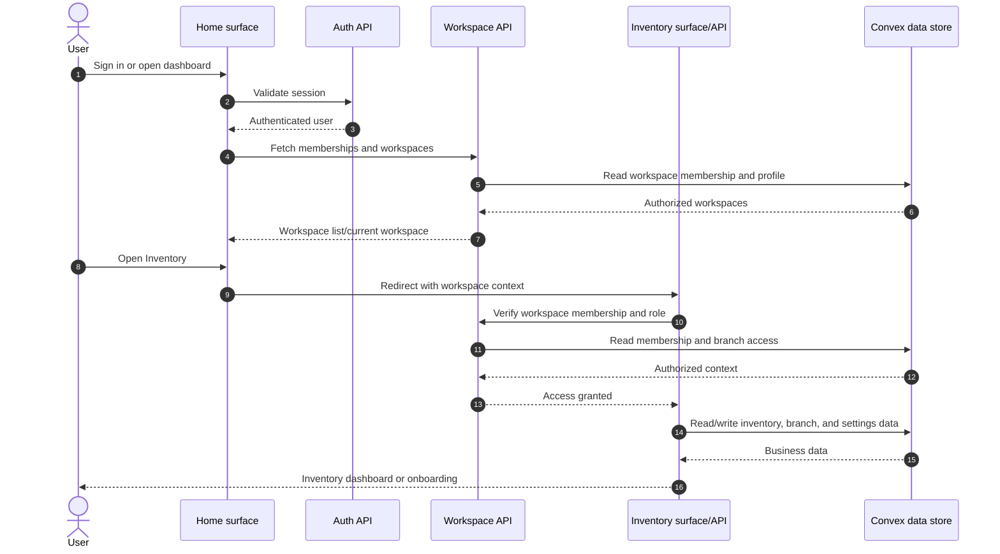

# MVP system flow

Inventory is available to every authenticated organization member who has the
required workspace and role permissions. There is no organization or application
activation/deactivation step, state, or entitlement check in this flow.



Notes:

- Billing and subscription state remain independent of application access.
- Branch assignment, user roles, and inventory onboarding remain enforced.
- A legacy URL such as `/settings/applications` falls through to the dashboard;
  it no longer exposes an applications settings page.

## Session lifecycle

The browser keeps the 15-minute access JWT only in memory. The refresh
credential is opaque, stored only in a shared HttpOnly cookie, and persisted in
Convex as a hash. Its absolute expiry is set at login (7 days, or 30 days with
“remember me”) and is never extended by rotation.

```mermaid
sequenceDiagram
    autonumber
    actor User
    participant TabA as Browser tab A
    participant TabB as Browser tab B
    participant API as Fastify Auth API
    participant Cookie as HttpOnly refresh cookie
    participant Convex as Convex sessions

    User->>TabA: Sign in (optionally remember me)
    TabA->>API: POST /auth/login
    API->>Convex: createSession(hash, expiry, device metadata)
    Convex-->>API: session ID
    API->>Cookie: Set shared refresh cookie
    API-->>TabA: Short-lived access JWT

    Note over TabA,TabB: Access JWTs remain memory-only.
    TabA->>TabB: BroadcastChannel token_refreshed
    TabB-->>TabB: Store received access JWT in memory

    par Concurrent 401s
        TabA->>TabA: Acquire Web Lock
        TabB->>TabB: Await Web Lock / BroadcastChannel
    end
    TabA->>API: GET /auth/csrf then POST /auth/refresh
    API->>Cookie: Read refresh credential
    API->>Convex: rotateSession(old hash, new hash)
    Convex->>Convex: Revoke old row; link replacement; preserve absolute expiry
    Convex-->>API: New session
    API->>Cookie: Replace refresh cookie
    API-->>TabA: New access JWT
    TabA->>TabB: BroadcastChannel token_refreshed

    alt Reused or revoked refresh credential
        API->>Convex: rotateSession(old hash)
        Convex->>Convex: Audit reuse and revoke only presented session
        Convex-->>API: SESSION_REVOKED
        API->>Cookie: Clear refresh cookie
        API-->>TabA: 401 SESSION_REVOKED
        TabA->>TabB: BroadcastChannel refresh_failed
    end
```
