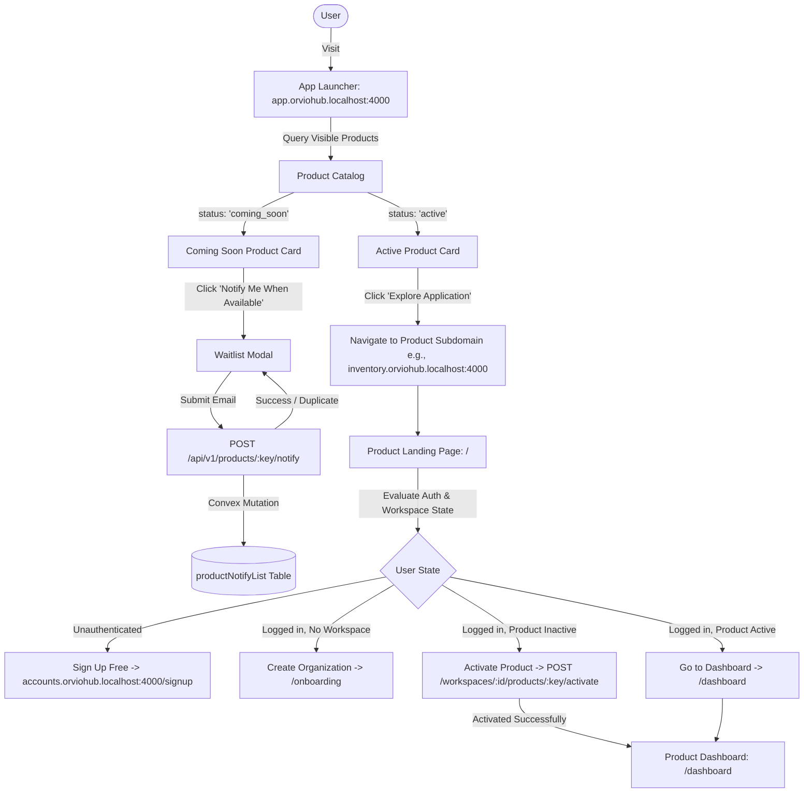

# Orviohub App Launcher & Product Discovery Flow

This document details the multi-tenant architecture, routing rules, data contracts, and user flows for discovering and activating applications across Orviohub's modular ecosystem.

---

## 1. Architecture & Flow Overview



---

## 2. Product Discovery Components

### 2.1 Product Catalog (`ProductCatalog.tsx`)
- **Location**: `frontend/src/surfaces/launcher/pages/ProductCatalog.tsx`
- **Purpose**: Central grid displaying all platform applications.
- **Rules**:
  - Filters out `draft` products.
  - Sorts products by `displayOrder` ascending.
  - Highlights featured products with gold `Featured` badge.
  - Highlights beta products with `BETA` badge.
  - Provides responsive grid (3 columns on desktop, 2 on tablet, 1 on mobile).
  - Includes real-time search filter and skeleton loading states.

### 2.2 Product Card (`ProductCard.tsx`)
- **Location**: `frontend/src/surfaces/launcher/components/ProductCard.tsx`
- **Variants**:
  - `active`: Vibrant dark purple gradient, full-opacity, "Explore Application" button linking directly to the product's dedicated subdomain.
  - `coming_soon`: 85% opacity, warm amber highlights, "Coming Soon" badge, and "Notify Me When Available" button opening waitlist modal.

### 2.3 Waitlist Modal (`JoinWaitlistModal.tsx`)
- **Location**: `frontend/src/surfaces/launcher/components/JoinWaitlistModal.tsx`
- **Capabilities**:
  - Auto pre-fills email for authenticated users.
  - Client-side email validation.
  - Duplicate detection: Displays friendly "Already on list" feedback if the normalized email is already recorded for that specific product.
  - Instant visual confirmation and auto-dismissal.

---

## 3. Product Landing Pages & Dynamic CTAs

### 3.1 Inventory Landing Page (`Landing.tsx`)
- **Location**: `frontend/src/surfaces/inventory/pages/Landing.tsx`
- **URL**: `http://inventory.orviohub.localhost:4000/`
- **Sections**:
  1. **Hero Section**: Product title, tagline, value proposition, and dynamic CTA button.
  2. **Live Hub Telemetry Preview**: Visual showcase of live warehouse units, online POS registers, and revenue metrics.
  3. **Features Showcase**: Multi-branch management, POS barcode scanning, purchase orders, branch staff roles, real-time analytics.
  4. **Pricing Grid**: Free trial, Standard, and Enterprise tiers with transparent NGN pricing.
  5. **FAQ & Demo Modal**: Guided product demo booking with interactive form.

### 3.2 Dynamic CTA Resolution Logic
The primary CTA button on the product landing page dynamically adapts based on the user's session and organization state:

| Authentication State | Workspace State | Product Status | Button Text | Action / Destination |
| :--- | :--- | :--- | :--- | :--- |
| **Guest (Unauthenticated)** | None | N/A | `Sign Up Free` | Redirects to `accounts.orviohub.localhost:4000/signup?product=inventory&returnUrl=...` |
| **Authenticated** | No Workspace | N/A | `Create Organization` | Navigates to `/onboarding` |
| **Authenticated** | Active Workspace | Not Activated | `Activate Inventory` | Calls `POST /api/v1/workspaces/:id/products/inventory/activate` and redirects to `/dashboard` |
| **Authenticated** | Active Workspace | Activated | `Go to Dashboard` | Navigates to `/dashboard` |

---

## 4. API & Database Specifications

### 4.1 Waitlist API

#### `POST /api/v1/products/:productKey/notify`
Adds an email to the waitlist for a coming-soon application.

- **Request Headers**:
  - `Content-Type: application/json`
  - `Authorization: Bearer <token>` *(optional)*
- **Request Body**:
  ```json
  {
    "email": "user@example.com"
  }
  ```
- **Response (200 OK - New Subscription)**:
  ```json
  {
    "success": true,
    "data": {
      "alreadySubscribed": false,
      "productKey": "crm",
      "email": "user@example.com"
    },
    "message": "You have been added to the waitlist. We will notify you upon launch!"
  }
  ```
- **Response (200 OK - Already Subscribed)**:
  ```json
  {
    "success": true,
    "data": {
      "alreadySubscribed": true,
      "productKey": "crm",
      "email": "user@example.com"
    },
    "message": "You are already on the waitlist for this product."
  }
  ```

### 4.2 Product Activation Check API

#### `GET /api/v1/workspaces/:workspaceId/products/:productKey/is-active`
Checks whether a workspace has activated a given product module.

- **Response (200 OK)**:
  ```json
  {
    "success": true,
    "data": {
      "isActive": true,
      "workspaceId": "ws_123",
      "productKey": "inventory"
    }
  }
  ```

### 4.3 Convex Queries & Mutations

| Module | Identifier | Type | Description |
| :--- | :--- | :--- | :--- |
| `products` | `products.listVisible` | Query | Returns all products with status `active` or `coming_soon` ordered by `displayOrder`. |
| `notifyList` | `notifyList.add` | Mutation | Inserts entry into `productNotifyList` table with duplicate check using `by_product_email` index. |
| `notifyList` | `notifyList.getByEmail` | Query | Returns all waitlist subscriptions for a normalized email address. |
| `workspaceProducts` | `workspaceProducts.isActive` | Query | Returns `boolean` indicating if a product is active/trial for a workspace. |
| `workspaceProducts` | `workspaceProducts.activate` | Mutation | Activates a product for a workspace, creates owner membership and audit log. |

---

## 5. Subdomain Authentication & Navigation Guide

1. **Cross-Subdomain Session**:
   - Authentication cookies are shared across all subdomains via `.orviohub.localhost` (or `.orviohub.com` in production).
   - In environments where wildcard cookies are restricted (e.g. cross-port dev), `getCrossSubdomainUrl()` attaches `auth_token` and `auth_user` parameters which are extracted on mount by `useAuthStore.ts`.
2. **Surface Routing Separation**:
   - `app.orviohub.localhost:4000`: Dedicated to App Launcher, Onboarding, and Workspace Selection.
   - `inventory.orviohub.localhost:4000`: Dedicated to Inventory Landing Page (public) and Inventory Dashboard (guarded).
   - `accounts.orviohub.localhost:4000`: Central authentication (Login, Signup, Password Reset, Profile).
